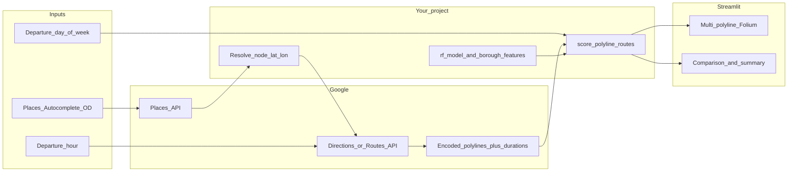

# Google multi-route + model scoring (Streamlit)

## Goal

- Use **Google Maps** to obtain **2–3** candidate routes (same origin/destination).
- **Score each route** with your **existing model** (frozen; no training on Google data).
- **Visualize** all routes on **one Folium map** in `streamlit_UI.py`, with clear labels for **Google’s “best”** (shortest duration) vs **your model’s “best”** (lowest estimated ETA).
- Add **per-route** metrics (Google duration vs model ETA) and a **summary** block: conclusion, agreement/disagreement, and short analysis text.
- Replace fixed start/end node dropdowns with Google-powered place selection so users can choose any origin and destination.
- Add day-of-week selection in `streamlit_UI.py` in addition to departure hour.

## Model capability check (time + day)

- Current model inputs in `routing_engine.py` are: `hour`, `is_weekend`, `is_rush_hour`, and borough one-hot flags.
- This supports hour-level effects and weekend-vs-weekday effects, but not full Monday-through-Sunday differences.
- Current `get_dynamic_cost` inference hardcodes `is_weekend` to `0`, so weekend selection will not affect output unless `routing_engine.py` is updated.
- Plan below includes a dedicated routing-engine update so day selection is actually used in ETA scoring.

## Architecture (data flow)

## 1. Google API integration

**Recommended starting point:** **Directions API** with `alternatives=true` (returns multiple routes when available; typically up to **three** in many regions). Simpler HTTP contract than Routes API v2 for “alternatives only.”

- **Request inputs:** `origin` / `destination` as `"lat,lng"` from `routing_engine.py` node attributes (`G.nodes[id]['lat']`, `'lon'`), `mode=driving`, `alternatives=true`, and optionally `departure_time` / traffic model if you want **traffic-aware** Google durations (billing and SKU differ—document in README).
- **Outputs per route:** `overview_polyline` (encoded), each route’s `duration` (and `duration_in_traffic` if requested), `distance`, `summary` (optional label).
- Use Google Places (Autocomplete + place details/geocoding) to convert user-chosen place text to `lat,lng` prior to Directions calls.

**Alternative:** **Routes API (Compute Routes)** if you standardize on the newer product—same UX plan, different request/response parsing.

**Secrets:** read API key from **`st.secrets["GOOGLE_MAPS_API_KEY"]`** (and optionally `os.environ` fallback for CLI). Add `.streamlit/secrets.toml` to `.gitignore` if not already (template only in docs, never commit real keys).

**Dependencies:** add a small HTTP client path (`requests`) or official client; add **`polyline`** (or equivalent) to **decode** the overview polyline to `[(lat, lon), ...]`. Record versions in a project **`requirements.txt`** (currently absent).

## 2. Scoring Google polylines with your model (no retraining)

Your RF expects **`ml_features`** in `routing_engine.py` (`hour`, `is_weekend`, `is_rush_hour`, borough one-hots). Google routes are dense lat/lng—not graph edges.

**Pragmatic scoring strategy** (document in code comments):

1. **Decode** polyline to a list of points; optionally **downsample** (e.g. every Nth point or max segment length) to limit work.
2. **Split** into consecutive segments; for each segment compute **length** (haversine or equirectangular in meters).
3. **Borough** for a segment: use **nearest node** from existing `routing_nodes` (reuse KDTree on coords in `routing_engine.py`) — build once at module load or pass `nodes`/`tree` into scorer.
4. **Time axis:** maintain a running **`current_time_sec`** starting at `hour * 3600`; for each segment, derive `hour` / `is_rush_hour` from `current_time_sec` (match `get_dynamic_cost` semantics); derive **`is_weekend`** from selected day (`Sat/Sun -> 1`, else `0`).
5. **Segment ETA:** use **`rf_model.predict`** on one row per segment with those features (same as ML fallback branch in `get_dynamic_cost`). **Scale** by segment: either treat prediction as “seconds per unit distance” with a cap, or **blend** `length / v_ref` with RF output—pick one rule and apply consistently so totals are stable.

Expose a single function, e.g. **`score_polyline_eta_seconds(points, departure_hour) -> float`**, implemented in a **new module** (e.g. `google_route_scoring.py`) to avoid bloating `routing_engine.py`. Import **`rf_model`**, **`ml_features`**, and **`nodes`** (or pass dependencies in).

**Caveat (for UI disclaimer):** model ETA on a Google polyline is an **approximation** (your model was not trained on those segments); the comparison is still useful as a **benchmark narrative**, not ground truth.

## 3. Route labeling: “Google best” vs “model best”

After scoring:

- **`google_best_index`** = `argmin` of Google’s `duration` (or `duration_in_traffic` if used consistently).
- **`model_best_index`** = `argmin` of your **`model_eta_seconds`**.

In the UI:

- Assign each polyline a **stable color** (e.g. blue / orange / purple).
- **Legend / tooltips:** e.g. “Route 1 — Google’s fastest”, “Route 2 — Our model’s pick”, or both badges if one route wins both.
- If Google returns **fewer than 3** routes, show only what’s returned and note “Fewer alternatives available for this OD.”

## 4. Streamlit UI changes (`streamlit_UI.py`)

- **Replace** (or gate) the current single **`predict_route`** flow for this feature: primary action becomes **“Compare routes”** (or keep a tab: **Internal graph route** vs **Google comparison** if you want to preserve old behavior).
- Replace current fixed-node start/end controls with Google Places-backed controls so users can pick any location.
- Add a day-of-week selector (`Mon` … `Sun`) alongside the departure hour slider.
- On button click:
  1. Resolve **lat/lng** for start/end from selected place results.
  2. Call Google; handle errors (no API key, ZERO_RESULTS, OVER_QUERY_LIMIT) with **`st.error`** / **`st.warning`**.
  3. Decode polylines; compute **model ETA** per route using selected hour + derived `is_weekend`; collect **Google duration** per route.
  4. Store structured results in **`st.session_state`** (same pattern you use for `route_result`) so the map **persists** across reruns.
- **Map:** new helper e.g. **`render_multi_route_map(routes_meta)`** (in `routing_engine.py` or a small `map_utils.py`): one `folium.Map`, multiple **`PolyLine`** layers with distinct colors, **start/end markers**, **`folium.LayerControl`** or a **`MacroElement`** legend for labels.
- **Per-route section:** for each route index, show small metric row or **`st.dataframe`**: Route ID, Google duration, model ETA, delta (seconds / %), distance if available.
- **Summary section:** markdown or **`st.info`**:
  - Which route is **fastest per Google** vs **fastest per model**.
  - Whether they **agree**; if not, **by how much** (time gap).
  - One paragraph of **analysis** (templated strings + numeric inserts—no LLM required): e.g. agreement, largest discrepancy, reminder that model is approximate on non-graph geometry.

## 5. Files to add or touch

| Area | Action |
|------|--------|
| New: `google_places.py` (or merged with API helpers) | Place search/autocomplete resolution to `lat,lng` for arbitrary user-selected OD |
| New: `google_directions.py` (name flexible) | Build request URL / headers, parse JSON, return list of `{polyline_encoded, duration_sec, distance_m}` |
| New: `google_route_scoring.py` | `score_polyline_eta_seconds`, nearest-node borough, RF accumulation |
| `routing_engine.py` | Add day-aware cost inputs (`is_weekend`) to dynamic cost and route prediction flow; keep map helpers |
| `streamlit_UI.py` | Add Places-based OD inputs, day + hour controls, session state, tables, summary, `st_folium` multi-route rendering |
| `requirements.txt` | `requests`, `polyline`, pin versions; document Streamlit + existing deps |
| `.gitignore` | Ensure `.streamlit/secrets.toml` ignored if you document local secrets |
| `README.md` or `docs/` | How to enable Google API (Directions + billing), required secrets, feature limitations |

## 6. Plan to edit `routing_engine.py` for day-of-week mapping

1. Update `get_dynamic_cost` to accept `is_weekend` as an input and remove hardcoded `is_weekend: 0`.
2. Update `predict_route` to accept day context (e.g., `is_weekend`) and pass it into each dynamic edge-cost call.
3. Keep `is_rush_hour` derived from each segment’s hour, but derive `is_weekend` from Streamlit’s selected day.
4. Ensure Google polyline scoring uses the same day/time rule for consistency with internal routing estimates.
5. Preserve compatibility by defaulting `is_weekend=0` until all callers are upgraded.

## 7. Testing (manual)

- With a valid key: run app, pick two nodes with known driving connectivity, verify **2–3** polylines when alternatives exist.
- Verify **session_state** keeps map visible after interaction (same pattern as current `route_result`).
- Edge cases: **one** route returned; API failure; decode empty polyline.
- Verify weekend selection changes ETA output versus weekday for the same OD/hour where RF fallback is used.

## 8. Optional follow-ups (out of scope unless you ask)

- Traffic-aware Google vs fixed hour alignment.
- **`predict_route`** retained as “internal baseline” third visualization—adds a fourth line and clearer clutter unless simplified.

## Implementation checklist

- [ ] Add Places-backed origin/destination selection (user can choose any place, not only preloaded nodes)
- [ ] Add day-of-week selector in `streamlit_UI.py` and derive `is_weekend`
- [ ] Add `google_directions.py`: Directions API with alternatives, polyline + duration parsing; env / `st.secrets` key loading
- [ ] Add `google_route_scoring.py`: decode polyline, segment-wise RF ETA using nearest-node borough + cumulative hour (reuse `ml_features` / `rf_model`)
- [ ] Update `routing_engine.py` to pass `is_weekend` through dynamic cost and route prediction logic
- [ ] Implement `render_multi_route_map` (colors, LayerControl / legend, start/end markers)
- [ ] Refactor `streamlit_UI.py`: compare flow, session state, per-route metrics table, summary/analysis block, `st_folium` integration
- [ ] Add `requirements.txt` pins; document API key + Directions SKU in README; gitignore secrets template
